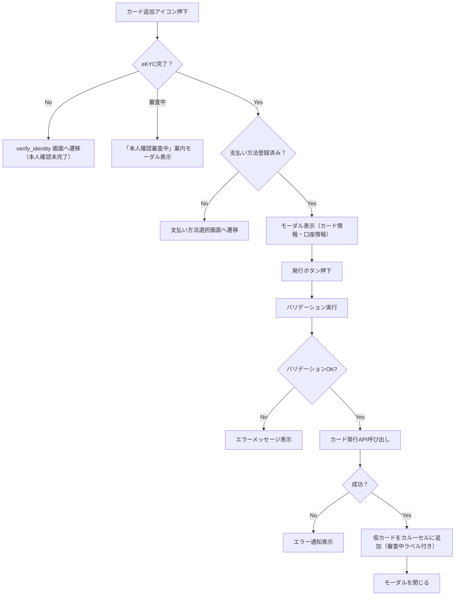

# コンポーネント仕様：カード追加モーダル（card_add_modal.dart）

## 1. 概要

- ホーム画面から新しいカードを追加するためのモーダルコンポーネント
- 必要な入力情報を受け取り、カード発行APIを呼び出す
- 入力完了後、カルーセルにカードが即時反映される仕様
- ※カード追加機能は、eKYC（本人確認）が完了しているユーザーにのみ提供されます。未完了ユーザーはモーダルを開けないか、別途案内メッセージを表示します。

## 2. UI構成

### 2.1 カード情報入力セクション

詳細は以下のフォームコンポーネントを参照してください。  
[カード情報入力フォーム](./form/card_add_form.md)

### 2.2 銀行口座情報入力セクション

詳細は以下のフォームコンポーネントを参照してください。  
[銀行口座情報入力フォーム](./form/bank_account_form.md)  
※銀行口座情報は支払い方法としての登録が必須です。登録がない場合、カード追加モーダルは開かれず、まず支払い方法の選択画面に遷移します。

## 3. 処理フロー（Mermaid）

## 4. 入力バリデーション仕様

詳細なバリデーション仕様は以下に分離記載：  
- [カード情報のバリデーション仕様](./form/card_add_form.md#入力バリデーション仕様)  
- [銀行口座情報のバリデーション仕様](./form/bank_account_form.md#入力バリデーション仕様)

## 5. 状態管理

- `cardAddFormProvider`（想定）：フォーム入力状態とバリデーション状態を管理
- `cardProvider`：新規カードデータを追加してカルーセルに反映
- `authProvider`：eKYCの完了状態（例：`isKycCompleted`）を参照し、カード追加の可否を制御

## 6. テスト観点

- 各入力欄が正しく表示されること
- 未入力で発行ボタンを押すとバリデーションエラーになること
- 入力が正しい場合にAPIが呼び出されること
- 発行成功後、カードがリストに追加されること
- 発行失敗時にエラーメッセージが表示されること

## 7. 技術仕様メモ

- モーダルは `showModalBottomSheet` または `showDialog` で表示
- 通貨・国の選択肢は定数リストまたはAPIで取得
- カード発行API：`POST /cards`（想定）
- 発行成功後、APIレスポンスを `cardProvider` に追加し画面を更新
- アニメーションあり：カード追加時にフェードイン／スライドアップ
- 発行直後は仮カードとして `cardProvider` に追加し、「審査中」ステータスで表示。審査完了後、本カード情報に自動更新される想定。

## 8. 備考

- ユーザー体験を損なわないため、非同期処理中はローディング表示を行う
- バリデーションエラーはフィールドごとに明示
- エラー内容は共通仕様：[`specs/common/error_codes.md`](../specs/common/error_codes.md) を参照
- eKYC未完了のユーザーがカード追加を試みた場合は、案内メッセージを表示した上で verify_identity 画面へ遷移する動線を設ける。また、カード発行後は仮カード表示にて「審査中」である旨を明示し、利用可能状態ではないことをユーザーに伝える。