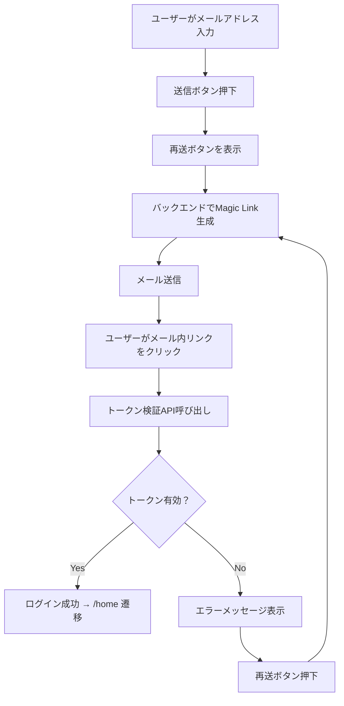

# 画面構成ルール（複数機能対応テンプレート）

このドキュメントは、Flutterアプリにおける各画面仕様の共通記述ルールを定義します。1画面に複数機能が存在する場合を考慮したフォーマットです。

---

## 1. 概要

- 画面の目的・役割を端的に記載
- 提供される主な機能一覧を列挙

## 2. 機能

- ログイン
- サポート誘導

## 3. 機能仕様一覧

### 3.1 ログイン

#### UI構成

| 要素名             | 種類           | 説明                                         |
|--------------------|----------------|----------------------------------------------|
| メールアドレス入力欄 | TextField       | ログインに使用するメールアドレスを入力         |
| 認証リンク送信ボタン | ElevatedButton  | 入力されたメールアドレスにMagic Linkを送信     |
| 認証リンク再送ボタン | TextButton      | リンク未着・期限切れ時に再送リクエストを送信   |

#### 入力バリデーション

- 空欄チェック
- `@` を含むか
- `.` を含むか（ドメイン形式チェック）
- 入力先頭・末尾に空白がないか（`trim()`処理）
- 全角文字が含まれていないか（例：全角＠）※推奨
- 320文字以内か（RFC準拠：64 + 255）
- 正規表現例：`^[^\s@]+@[^\s@]+\.[^\s@]+$`

#### 処理フロー図（Mermaid）

#### 固有仕様（任意）

- 押下後、30秒間は認証リンク再送ボタンを無効化（フロントエンドで制御）
- 同一ユーザーにつき、1時間あたり最大5回まで送信可能（バックエンドで制御）
- 有効なMagic Linkが既に存在する場合は再生成しない（トークン有効期間内は再発行スキップ）
- Bot対策として、必要に応じて CAPTCHA等を追加検討

#### テスト観点（ログイン）

- 入力が空欄のまま送信 → エラーメッセージが表示されること
- 無効なメール形式で送信 → エラーになること
- 有効なメールアドレスで送信 → APIが呼ばれること
- Magic Linkからの復帰時 → トークンが正常なら/homeに遷移すること
- 再送ボタン押下時の無効化制御（30秒間）
- 1時間あたりの送信回数制限動作確認
- サポートリンクからの遷移確認

#### 技術仕様メモ（ログイン）

- Magic Link は1回限り・15分間有効の仕様で設計予定
- トークン検証API（`/auth/verify_magic_link`）によりセッション開始
- 再送時も前回と同じトークンが再発行される仕様、または更新トークンで再生成
- バックエンドからの送信には SendGrid または Firebase Auth などを想定
- セッション維持は JWT＋Secure Cookie方式を想定
- CAPTCHA導入はBot対策として検討中

---

### 3.2 サポート誘導

#### UI構成

| 要素名           | 種類      | 説明                           |
|------------------|-----------|--------------------------------|
| サポートへのリンク | TextButton | メールが届かない場合の対応手段を案内 |

#### 遷移仕様

- サポートページやヘルプ画面へ遷移
- メール未着やトラブル時の案内導線として機能

#### テスト観点（サポート誘導）

- サポートリンク押下 → 遷移先画面に移動すること

#### 技術仕様メモ（サポート誘導）

- 遷移先URLは環境変数で切り替え可能

## 4. 汎用仕様（画面共通）

### ローディング・エラー表示

- 認証リンク送信中はローディングスピナーを表示
- エラーメッセージはトーストで画面下部に表示
- 入力エラーはフォーム下部に赤字で明示

### 遷移元・遷移先の関係

- 遷移元：splash（認証状態を確認後、未認証ならログイン画面へ）
- 遷移先：home（ログイン成功時）

### アクセシビリティ対応（任意）

- 入力欄にラベルを明示的に付与
- ボタンに読み上げ用のラベルを設定（例：`semanticsLabel`）
- フォーカス順序の適切な設定
- カラーハイコントラスト対応

### 言語・地域対応（任意）

- 表示文言はi18n化されているか
- 各国のバリデーション仕様に配慮（例：メール・電話番号等）
- 文言ファイルの管理と更新ルール