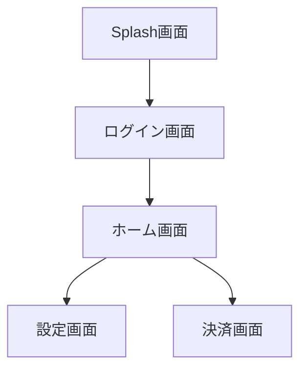

# 画面遷移図（Mermaid記法）

```mermaid
graph TD
    Splash["Splash画面"]
    Login["ログイン画面"]
    Home["ホーム画面"]
    Settings["設定画面"]
    Payment["決済画面"]

    Splash --> Login
    Login --> Home
    Home --> Settings
    Home --> Payment
```