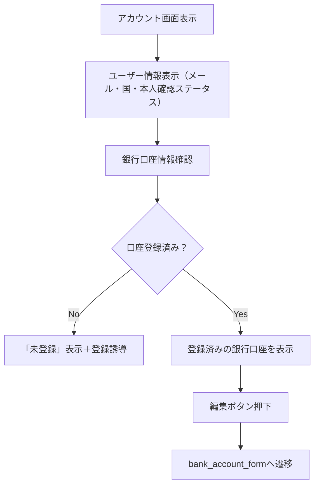

# 画面仕様：アカウント（account_screen.dart）

## 1. 概要

- ユーザーの登録情報やアプリ設定を確認・変更できる画面
- 居住国・本人確認状態・銀行口座の登録状況などを確認可能
- セキュリティ操作やアカウント管理（ログアウト・削除）も提供

## 2. 機能一覧

### 2.1 ユーザー情報表示機能

| 項目             | 内容                                       |
|------------------|--------------------------------------------|
| メールアドレス       | 登録済みのメールアドレスを表示（編集不可）              |
| 居住国             | 選択された国情報（編集不可、本人確認時に入力）            |
| 本人確認ステータス     | 未登録／審査中／完了／差し戻し などを表示                   |

### 2.2 銀行口座情報管理機能

| 項目           | 内容                                               |
|----------------|----------------------------------------------------|
| 銀行口座情報       | 登録済みの口座情報（下4桁、銀行名など）                      |
| 銀行口座変更ボタン   | 押下で `bank_account_form.dart` に遷移し、再登録・修正が可能         |
| 銀行口座未登録の場合 | 「未登録」の表示と共に、登録画面への遷移ボタンを表示               |

### 2.3 アプリ設定遷移機能

| 項目       | 内容                                                         |
|------------|--------------------------------------------------------------|
| 設定ボタン   | `settings_screen.dart` に遷移。通知設定やポリシー確認が可能     |

## 3. 処理フロー（Mermaid）

## 4. 状態管理

- `userProvider`：ユーザー情報（メール・国・本人確認ステータスなど）
- `bankAccountProvider`：銀行口座情報の取得と更新状態を管理

## 5. テスト観点

- 正常時にユーザー情報が正しく表示されること
- 銀行口座の有無に応じて表示内容が変化すること
- 登録済み口座の編集ボタンが正しく動作し、フォームへ遷移すること
- ログアウト操作でセッションが正しく解除されること
- アカウント削除操作時に確認ダイアログが表示され、同意後に削除が実行されること

## 6. 備考

- 表示はシンプルなリスト形式を想定し、各セクションに見出しと区切りを設ける
- 銀行口座の登録状況を視認しやすくし、未登録の場合は積極的に登録を促す構成
- 将来的な機能追加（通知設定、生体認証設定など）を想定した設計