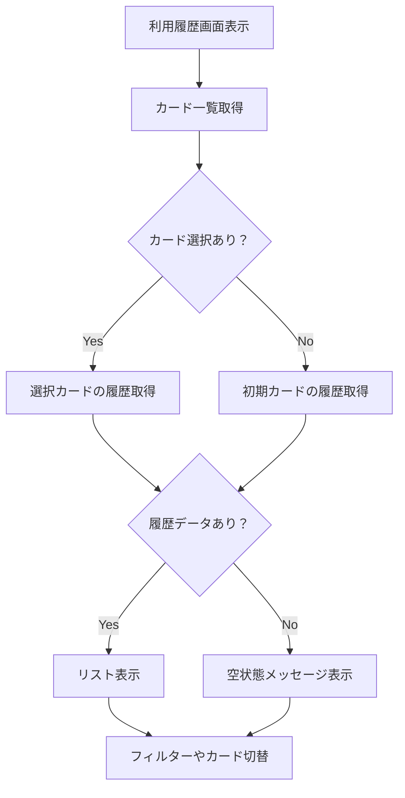

# 画面仕様：利用履歴（activity_screen.dart）

## 1. 概要

- ログインユーザーのクレジットカード利用履歴を確認できる画面
- 発行済みカードごとの利用履歴を時系列で一覧表示
- カード選択による履歴の切替や、フィルタリング機能を提供
- 空状態や取得失敗時のフィードバックも考慮

## 2. 機能一覧

### 2.1 利用履歴の一覧表示

| 要素名       | 種類       | 説明                                         |
|------------|----------|--------------------------------------------|
| 履歴リスト     | ListView | カード利用履歴の一覧（最新順）                        |
| 履歴アイテム   | ListTile  | 利用日付、店舗名、金額、決済状態を表示                  |
| 空状態表示     | Text/Icon | 利用履歴がない場合の案内表示                         |

- 最新順に履歴を表示（スクロール可能）
- 店舗名／カテゴリアイコン／金額（外貨）を表示
- 決済状況（成功／失敗／保留）に応じたスタイル切替

### 2.2 カード切替・フィルター機能

| 要素名           | 種類         | 説明                              |
|----------------|------------|---------------------------------|
| カード選択ドロップダウン | DropdownButton | 表示対象カードの切替を提供                 |
| フィルターボタン     | IconButton   | 利用月やカテゴリでの絞り込みUIを表示         |

- カードを切替えることで該当履歴のみ表示
- フィルター：年月・カテゴリ・金額範囲などを対象

### 2.3 エラー・ローディング表示

- 通信中はローディングインジケータを表示
- 取得失敗時はエラーメッセージを表示し、再試行ボタンを表示

## 3. 処理フロー（Mermaid）

## 4. 状態管理

- `activityProvider`：利用履歴データの取得・一覧保持・フィルタ状態の管理
- `cardProvider`：カードの選択状態を取得
- `loadingState`：データ取得中のインジケータ表示管理

## 5. テスト観点

- 複数カードの切替で正しい履歴が表示されること
- 空状態で案内が正しく表示されること
- 通信エラー時にエラー表示と再試行が可能なこと
- フィルタ機能で履歴が適切に絞り込まれること
- 最新の履歴から順に表示されていること

## 6. 技術仕様メモ

- API：`GET /cards/{cardId}/activities`
- データ構造：
  - `date`（利用日付）、
  - `merchantName`（店舗名）、
  - `amount`（金額）、
  - `currency`（通貨）、
  - `status`（決済ステータス：success / failed / pending）
- 表示フォーマット例：
  - `2025/06/11 - Starbucks - ¥1,200 - 成功`
- フィルター処理はローカルに保持された履歴から抽出可能
- 履歴はカード切替時に非同期で再取得

## 7. 備考

- 今後、詳細画面（明細タップで詳細表示）やレシート表示機能など拡張予定
- アプリ共通のナビゲーションバーが本画面下部に表示される（詳細は [`components/ui/navigation_bar.md`](../components/ui/navigation_bar.md) を参照）