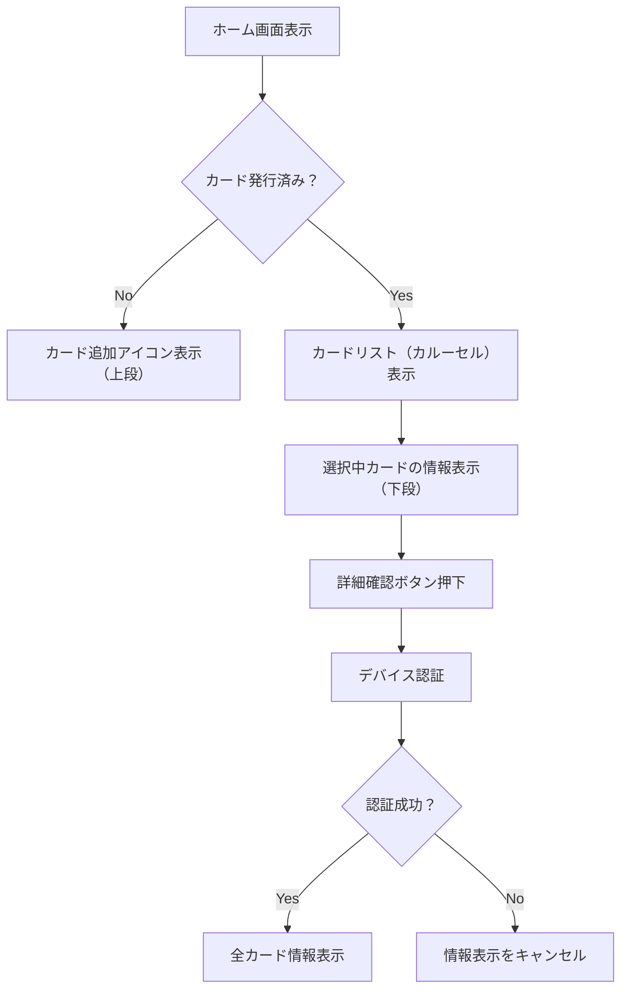

# 画面仕様：ホーム（home_screen.dart）

## 1. 概要

- ログイン後のメイン画面
- 発行済みカードの確認や新規カードの追加を行うメイン画面
- iOSのウォレットアプリを参考にしたUI構成
- カードの有無に応じた表示切替と、セキュリティを意識した詳細表示機能を提供
- カード詳細情報の確認にはローカル認証（生体認証または端末パスコード）を使用

## 2. 機能一覧

### 2.1 カード表示・切り替え機能

| 要素名           | 種類       | 説明                                             |
|----------------|----------|------------------------------------------------|
| カードビュー       | CardWidget | 発行済みカードのビジュアル表示                            |
| カード追加アイコン   | IconButton | カード未発行時：中央表示 / 発行済み時：右上表示              |
| カルーセル表示     | PageView | 複数カードがある場合、スワイプで切り替え可能                   |

- 未発行時：カード表示エリアに「カード型の追加アイコン」を表示
- 発行済み時：画面右上に「＋」アイコンを表示し、新規発行へ誘導
- 複数カードがある場合はカルーセル形式で表示し、スワイプで切替可能
- タップで現在アクティブなカードを選択状態に変更

### 2.2 カード追加機能

- カード追加アイコン押下時、モーダルウィジェット（`card_add_modal.dart`）を表示
- 入力完了後、カード発行APIを呼び出し、成功時はカルーセルに反映
- 仕様詳細は [`components/ui/card_add_modal.md`](../components/ui/card_add_modal.md) を参照

### 2.3 カード詳細情報確認機能

| 項目           | 内容                                     |
|--------------|----------------------------------------|
| 発行国         | カード発行元の国情報                           |
| 発行年月日       | カードが初めて発行された日付                     |
| 有効期限       | MM/YY形式                               |
| 利用上限残高     | 表示単位：円／ドル                         |
| カード番号       | 下4桁のみ表示                            |
| CVC          | 表示はマスキング（****）                    |
| 詳細確認ボタン   | 認証後に全情報を表示するためのボタン（ローカル認証）     |

- 詳細確認ボタン押下 → ローカル認証（Face ID／Touch ID／パスコード）
- 認証成功後：マスキングが解除され、フルカード番号・有効期限・CVCを表示

### 2.4 KYCステータスバー表示機能

- 画面上部に KYC 審査中や失敗時のステータスを表示
- ステータス内容に応じて、バーの文言・色・アイコンが変化
- 「再提出が必要」な場合は、該当画面へのリンク付きボタンを表示
- UI仕様の詳細は [`components/ui/kyc_status_bar.md`](../components/ui/kyc_status_bar.md) を参照

- 表示対象は以下の条件：
  - `userProvider.kycStatus` が `"reviewing"` または `"rejected"` のとき

## 3. 処理フロー（Mermaid）



## 4. 状態管理

- `cardProvider`：カード情報の一覧と選択状態を管理
- `authProvider`：認証状態（ログイン）を保持
- `secureAuthProvider`（想定）：ローカル認証の完了状態を一時保持（表示制御）

## 5. テスト観点

- 発行済みカードがない場合にカード追加アイコンが表示されること
- 発行済みカードがある場合に正しくリスト表示され、切替可能であること
- 詳細確認ボタン押下時に認証ダイアログが表示されること
- 認証成功時にフルカード情報が表示されること
- カードが1枚もないとき → 追加アイコンが中央に表示される
- 複数カードがあるとき → スワイプで切り替え可能
- ボタン押下時に生体認証や端末パスコードが起動する
- 認証成功で詳細が表示され、失敗時は表示されない

## 6. 技術仕様メモ

- カードデータはAPI `/cards` から取得（非同期）、`cardProvider` から取得し状態に応じて表示を切り替える
- 認証には `local_auth` パッケージを利用（Face ID／Touch ID対応）
- 認証コード例：

  ```dart
  final auth = LocalAuthentication();
  final didAuthenticate = await auth.authenticate(
    localizedReason: 'カード情報を表示するには認証が必要です',
    options: const AuthenticationOptions(
      biometricOnly: false,
      stickyAuth: true,
    ),
  );
  ```

- Android/iOSともに同一コードで動作
- 認証後は状態管理で表示内容を切り替え
- 詳細情報表示時、カードデータは一時メモリにのみ保持
- アニメーション表示：カード切替時は `PageView`＋スナップ効果で実装予定

## 7. 備考

- 表示レイアウトは iOS Wallet に類似したUIを想定
- カードが存在しない状態を明示し、次のアクション（カード発行）へ自然に誘導する構成
- ローカル認証はセキュリティを担保しつつ、利便性を保つ目的で導入
- 本画面下部には共通のナビゲーションバーが表示される（詳細は [`components/ui/navigation_bar.md`](../components/ui/navigation_bar.md) を参照）