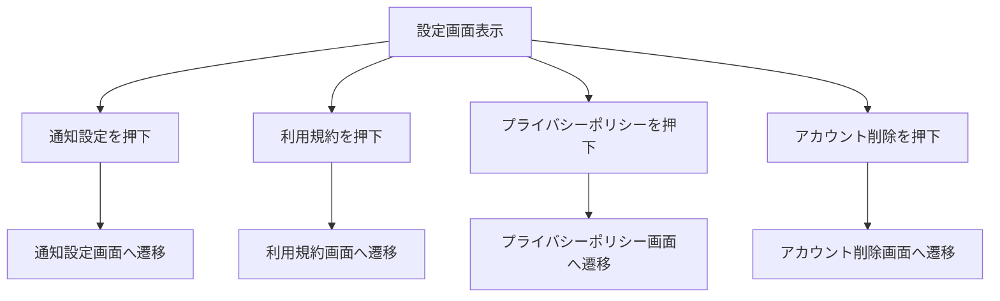

# 画面仕様：設定（settings_screen.dart）

## 1. 概要

- アカウント画面から遷移可能な設定画面
- 各種ポリシーや通知設定、アカウント削除などにアクセスできる
- 各項目は一覧で表示され、タップで個別画面に遷移

## 2. 機能一覧

### 2.1 設定項目の一覧表示

| 要素名           | 種類       | 説明                                             |
|----------------|------------|--------------------------------------------------|
| 設定リスト       | ListView   | 各種設定項目をリスト形式で表示                  |
| 通知設定項目     | ListTile   | 通知のON/OFF設定画面への遷移リンク               |
| 利用規約         | ListTile   | 利用規約画面への遷移リンク                       |
| プライバシーポリシー | ListTile | プライバシーポリシー画面への遷移リンク           |
| アカウント削除    | ListTile   | アカウント削除画面への遷移リンク（確認画面あり） |

- 各設定項目はタップ可能で、個別の画面に遷移する

### 2.2 遷移先の構成

- 通知設定画面（`notification_settings_screen.dart`）
  - 通知のトグル設定、通知説明文の表示
- 利用規約画面（`terms_screen.dart`）
  - WebView または静的文章の表示
- プライバシーポリシー画面（`privacy_policy_screen.dart`）
  - WebView または静的文章の表示
- アカウント削除画面（`account_delete_screen.dart`）
  - アカウント削除確認とボタンの表示

## 3. 処理フロー（Mermaid）

## 4. 状態管理

- `settingsProvider`（想定）：通知のON/OFFなどユーザー設定を保持
- 各画面は個別の状態を持ち、必要に応じて Provider や Riverpod を利用

## 5. テスト観点

- 各項目がリストに表示されていること
- 各リスト項目タップで正しい画面に遷移すること
- 通知設定のトグルが保存・反映されること
- アカウント削除操作時、確認を経て削除されること

## 6. 技術仕様メモ

- 通知設定トグルは `SwitchListTile` を利用
- ポリシー画面は WebView または Markdown 表示を想定
- 遷移には `Navigator.push` を使用