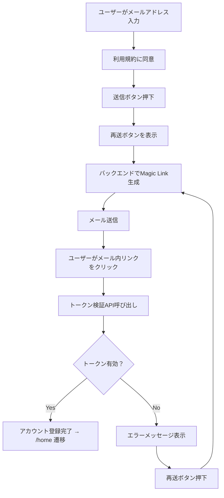

# 画面仕様：サインアップ（signup_screen.dart）

## 1. 概要

- 新規ユーザーがメールアドレスを用いてアカウントを登録する画面
- Magic Link方式でアカウント登録とログインを同時に実現
- 利用規約・プライバシーポリシーへの同意が必要

## 2. 機能

- アカウント作成（Magic Link認証）
- 利用規約同意チェック
- サポート誘導

## 3. 機能仕様一覧

### 3.1 アカウント作成（Magic Link）

#### UI構成

| 要素名               | 種類             | 説明                                         |
|----------------------|------------------|----------------------------------------------|
| メールアドレス入力欄   | TextField         | 登録に使用するメールアドレスを入力           |
| 認証リンク送信ボタン   | ElevatedButton    | 入力されたメールアドレスにMagic Linkを送信     |
| 認証リンク再送ボタン   | TextButton        | リンク未着・期限切れ時に再送リクエストを送信   |

#### 入力バリデーション

- 空欄チェック
- `@` を含むか
- `.` を含むか（ドメイン形式チェック）
- 入力先頭・末尾に空白がないか（`trim()`処理）
- 全角文字が含まれていないか（例：全角＠）※推奨
- 320文字以内か（RFC準拠：64 + 255）
- 正規表現例：`^[^\s@]+@[^\s@]+\.[^\s@]+$`

#### 処理フロー図（Mermaid）

#### 固有仕様

- 押下後、30秒間は認証リンク再送ボタンを無効化（フロントエンドで制御）
- 同一ユーザーにつき、1時間あたり最大5回まで送信可能（バックエンドで制御）
- 有効なMagic Linkが既に存在する場合は再生成しない（トークン有効期間内は再発行スキップ）

#### テスト観点（アカウント作成）

- 入力が空欄のまま送信 → エラー表示されること
- 無効な形式のメールアドレス → エラー表示されること
- 利用規約にチェックがない場合 → 送信ボタンが無効であること
- 有効なメールアドレスかつチェック有 → API呼び出しが行われること
- Magic Linkから復帰時 → 正常なら/homeに遷移

#### 技術仕様メモ（アカウント作成）

- Magic Linkは15分間有効・1回限り使用可
- FlutterSecureStorageでJWTアクセストークンを保存
- トークン検証API：`/auth/verify_magic_link`
- SendGridまたはFirebase Authを利用
- ユーザー登録とログイン処理は共通
- ログイン成功時、アクセストークンは `flutter_secure_storage` に保存（例：キー名 `"auth_token"`）
- 保存処理には `FlutterSecureStorage().write(key: 'auth_token', value: token)` を使用
- 保存されたトークンは `splash` 画面で読み出され、自動ログインに利用される

#### 既存メールアドレスの入力時対応

- 既に登録されているメールアドレスが入力された場合、バックエンドはHTTP 409エラーまたは `EMAIL_ALREADY_REGISTERED` エラーコードを返却する
- フロントエンドでは以下のメッセージを表示：
  - 「このメールアドレスはすでに登録されています。ログイン画面から認証リンクを再送してください」
- さらに、ログイン画面に遷移するためのボタンを表示し、ユーザーをスムーズに誘導する

#### テスト観点（既存メールアドレス）

- 登録済みのメールアドレスを入力 → エラーメッセージが表示されること
- エラー表示後、ログイン画面への遷移ボタンが表示され、押下すると正しく遷移できること

#### 技術仕様メモ（既存メールアドレス）

- バックエンドはサインアップ時に既存のユーザーを検知し、エラーとして返す
- フロントエンドはエラーコードをハンドリングし、UXを損なわずにログイン画面へ誘導する

---

### 3.2 利用規約同意チェック

#### UI構成

| 要素名               | 種類          | 説明                              |
|----------------------|---------------|-----------------------------------|
| 同意チェックボックス | Checkbox       | 利用規約・プライバシーポリシーに同意するための確認項目 |
| 利用規約リンク       | TextButton     | 利用規約ページへのリンク          |
| プライバシーリンク   | TextButton     | プライバシーポリシーページへのリンク |

#### 遷移仕様

- チェックがないと送信ボタンは無効
- 利用規約・ポリシーはWebViewまたはブラウザで表示

#### テスト観点

- チェックなし → 送信不可であること
- チェックあり → 送信ボタン有効であること

#### 技術仕様メモ

- チェック状態はStateとして保持
- 利用規約のURLは環境ごとに切り替え可能

---

### 3.3 サポート誘導

#### UI構成

| 要素名           | 種類      | 説明                           |
|------------------|-----------|--------------------------------|
| サポートへのリンク | TextButton | メールが届かない場合の対応手段を案内 |

#### 遷移仕様

- サポートページへ遷移

#### テスト観点

- サポートリンク押下 → 遷移先に移動できること

#### 技術仕様メモ

- 遷移先URLは環境変数で制御
