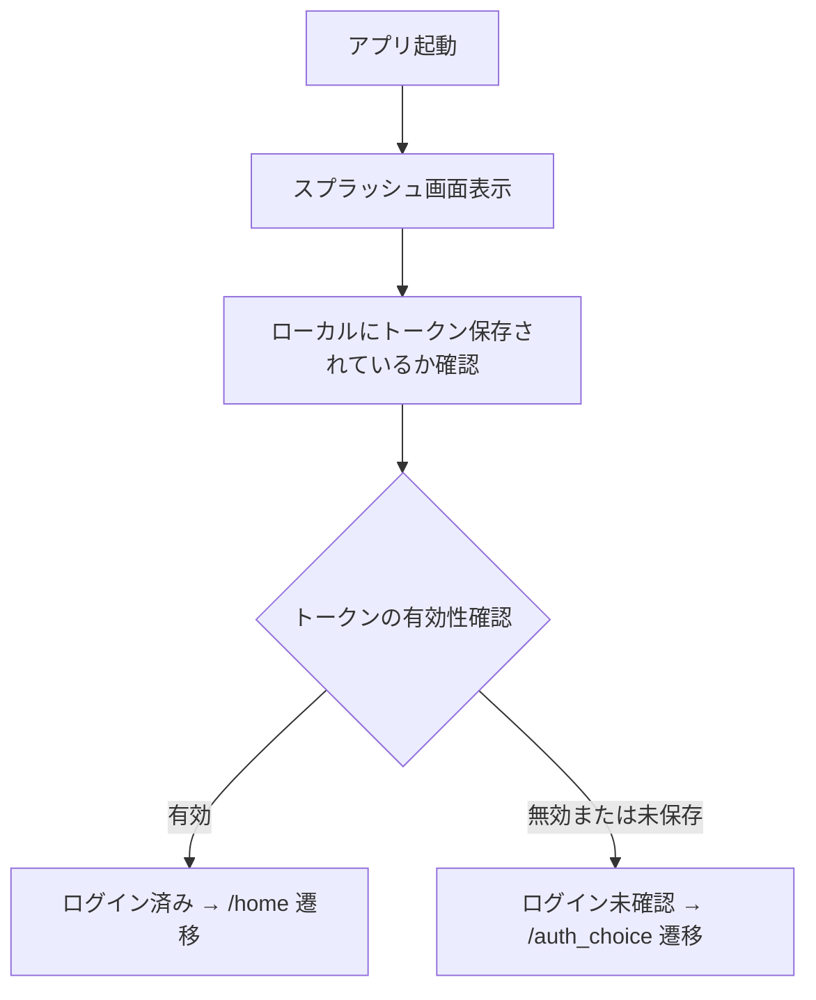

# 画面仕様：スプラッシュ（splash_screen.dart）

## 1. 概要

- アプリ起動時に表示される初期画面
- ユーザーがログイン済みかどうかを確認し、適切な画面に遷移させる役割を持つ
- ロゴ表示・初期化処理・状態チェックを担当

## 2. 対応ファイル

- Flutterファイル：`lib/screens/splash/splash_screen.dart`

## 3. 機能

- 認証状態の確認と遷移制御
- ロゴおよびローディング表示

## 4. 機能仕様一覧

### 4.1 認証状態の確認と遷移制御

#### UI構成

| 要素名         | 種類                          | 説明                               |
|----------------|-------------------------------|------------------------------------|
| ロゴ           | Image / Icon                  | 起動時に中央にアプリロゴを表示     |
| ローディング表示 | CircularProgressIndicator     | 状態確認・初期化中に表示される     |

#### 処理フロー図（Mermaid）

#### 技術仕様メモ

- `flutter_secure_storage` を利用してトークン取得を実施
- `Navigator.pushReplacementNamed()` によって画面遷移
- トークン有効性の確認は `isValid(token)` 関数で非同期処理として行う
- 初期化処理中はローディングインジケーターを表示
- 必要に応じて `Future.delayed()` でアニメーション表示時間の調整

#### テスト観点

- 有効なトークンが存在する場合、`/home` に遷移されること
- 無効またはトークンが存在しない場合、`/auth_choice` に遷移されること
- トークン確認中にローディングが表示されること
- ネットワークエラーなどによる例外時のフォールバック動作確認